## HACKATHON : MOVIE KIDS

### IDEA DE NEGOCIO:

Crear un sitio web colaborativo, donde los padres puedan encontrar series, videos o programas que tengan contenido adecuado para sus hijos mediante un sistema de valoraciones y recomendaciones.

## Planificación:

**DIA 1 :** MARTES 16

- **BENCHMARK** : ANÁLISIS DE LA COMPETENCIA
- **RESEARCH** : ENTENDIENDO LAS NECESIDADES DEL USUARIO
- **CUSTOMER JOURNEY:** VIAJE DEL USUARIO
- **ARQUETIPO DEL USUARIO:** EL USUARIO IDEAL
- **STORIES:** CASOS DE USO
- **DEFINIR EL MVP:** MINIMUM VIABLE PRODUCT
- **PATRONES DE INTERFAZ DE USUARIO (UI):**
- **SKETCH:** BOCETO DE NUESTRO PROYECTO
- **MOCKUP:** PLANTILLAS

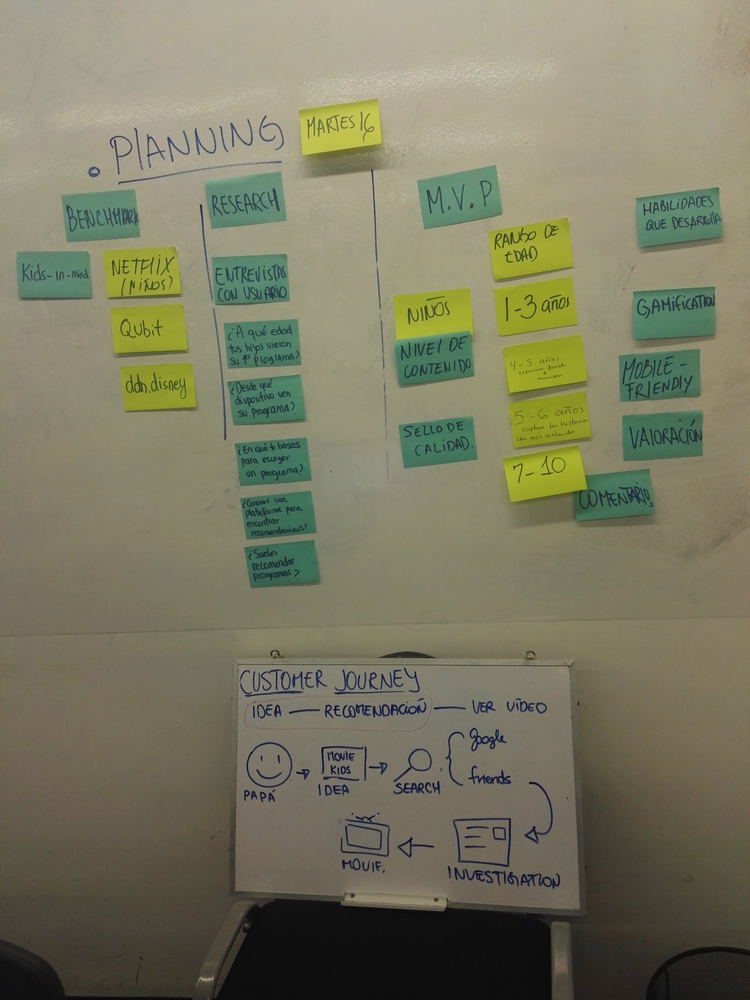

## BENCHMARK : Análisis de la competencia

### ¿Qué otros productos similares hay en el mercado?

En una rápida investigación por google, sólo se pudo encontrar una página enfocada a este segmento.

### **COMPETENCIA DIRECTA: KIDS IN MIND**

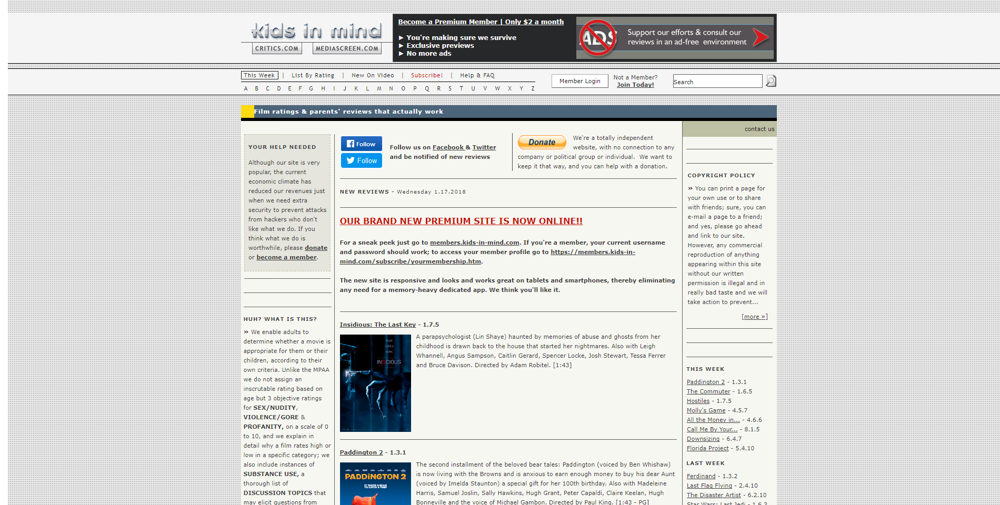

Observamos que es una página que no es amigable para el usuario además de contener demasiado texto donde uno logra perderse con facilidad.

## RESEARCH : Entendiendo las necesidades del usuario

Para crear nuestra web, se ha realizado entrevistas y encuestas (vía Google) para identificar las necesidades del usuario y así ofrecerle una mejor experiencia.

### Encuesta

https://goo.gl/forms/Rir8EdNjoP1Mmmhr2

**Resultados de la Encuesta**

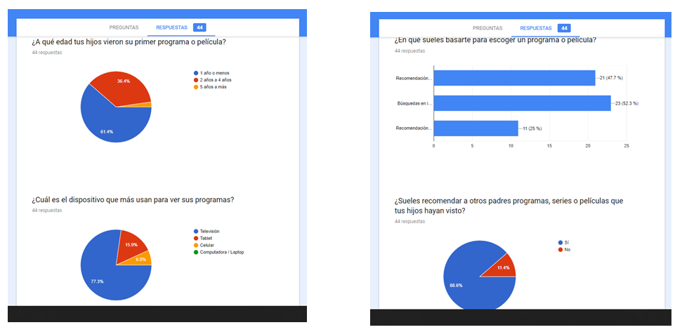
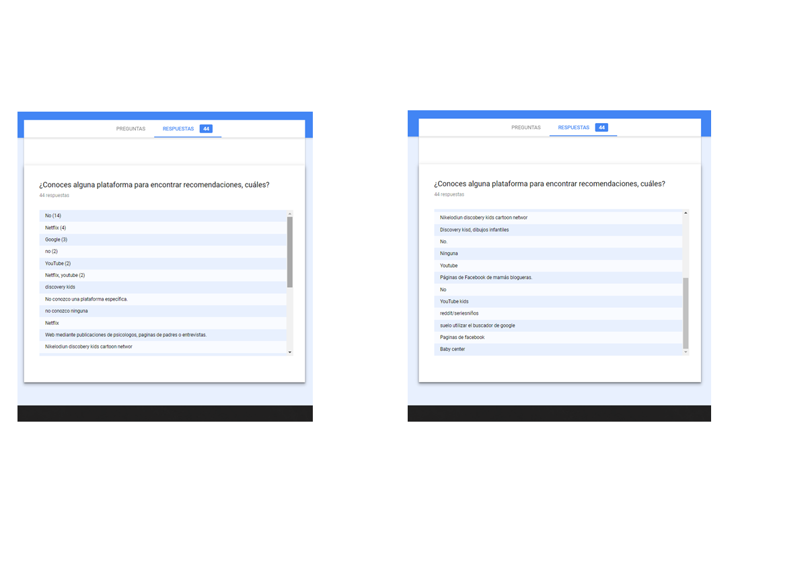

- Los padres por lo usual buscan recomendaciones de sus amigos o conocidos.

## CUSTOMER JOURNEY : Viaje del usuario

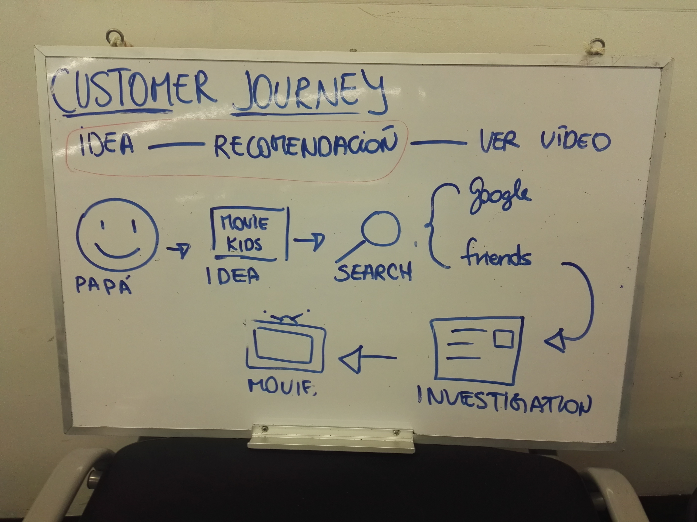

## ARQUETIPO DEL USUARIO

**Yeny Adama (26 años)**

- Ingeniera Industrial.
- Madre primeriza
- Trabaja entre 8 a 10 horas diarias de lunes a viernes.
- Tiene una bebe de 2 años.
- La suegra de Yeny es la que se encarga del cuidado de su bebe.
- A Yeny le preocupa el contenido de los programas que su suegra le hace ver a su bebe.
- Ella quisiera tener referencias de que peliculas o series son adecuados para que una niña de 2 años pueda ver.
- Yeny es consciente de que su hija debe ver programas que ayuden a su estimulacion y desarrollo.

**José Santos (29 años)**

- Padre soltero.
- Tiene una hija de 4 años.
- Trabaja de 8 a 9 horas al día como programador.
- No sabe mucho de programas de niños.
- Suele preguntar a la mamá que dibujos ve su hija.

## STORIES: Casos de uso

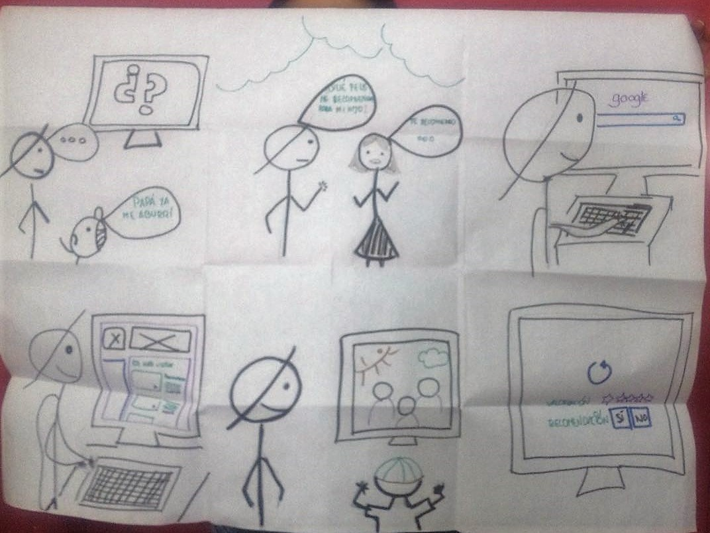

## DEFINIR EL MVP: MINIMUM VIABLE PRODUCT

Para nuestro mínimo producto viable, se ha considerado que la página contenga los siguientes elementos.

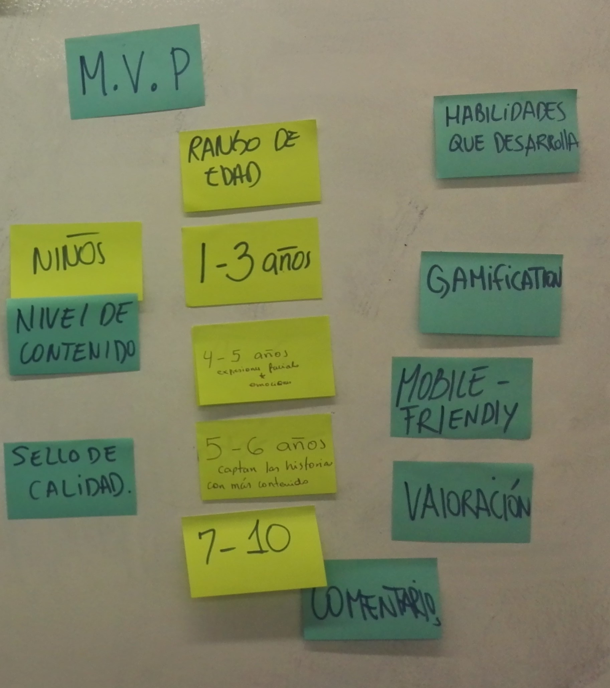

#### Parrones de Interfaz de Usuario (UI)

##### Tipos de Navegación

En base a nuestro bencharmark de la competencia directa e indirecta, se ha decidido lo siguiente:

**1. Navegación Combinada:** No vamos a utilizar en nuestra vista mobile solamente la navegación oculta (como el menú hamburguesa) ya que los participantes tardan más de cuando es visible. Es por esto, que los contenidos más demandantes la persona podrá verlo y acceder de forma rápida.

#### SKETCH

PENDIENTE: ADJUNTAR FOTOS DEL PROTOTIPADO

#### WIREFRAMES
**index.html**
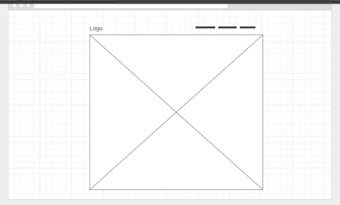

**home.html**
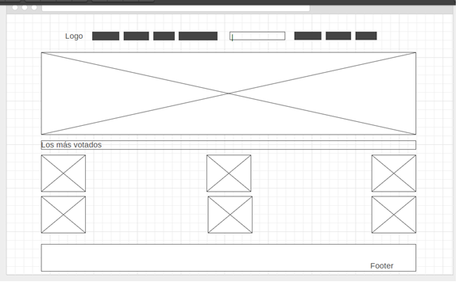

**list-movie.html**
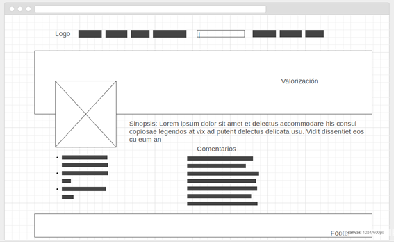

**login-signup.html**
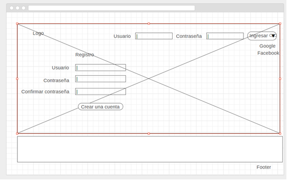

**profile-client.html**
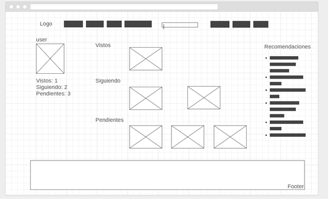

#### MOCKUPS

1. Creación de logo

2. Vista Home

#### Herramientas utilizadas:

1. HTML5
2. CSS3
3. Javascript
4. jQuery
5. Materialize
6. Illustrator

### **Integrantes**

>##### Andrea Cristina Tellería Pérez
>##### Betsy Dessiré Lara Aspilcueta
>##### Paola Silvana Huaman Luyo
>##### Stephanie Carolina Wong Vega

"La última y mejor experiencia que alguien tiene en cualquier lugar se convierte en la expectativa mínima de las experiencias que desean en todas partes."
